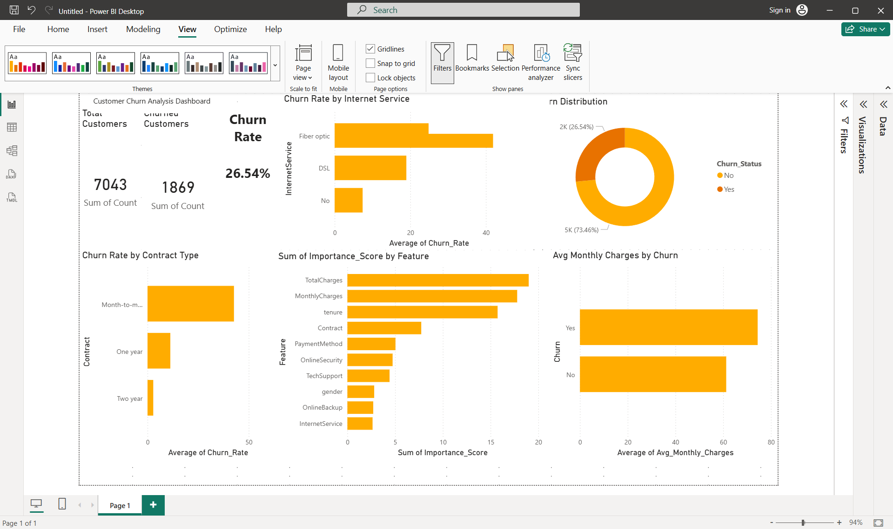

# 📉 Customer Churn Analysis & Prediction

## Project Overview
Analysed 7,043 telecom customer records to understand why customers 
leave and built a Machine Learning model to predict churn before it 
happens — enabling proactive retention strategies.

## Dashboard Preview

## Key Insights
- 📊 **26.54%** overall churn rate — 1 in 4 customers leaving
- 📋 **Month-to-month** customers churn at 7x the rate of 2-year contracts
- 🌐 **Fibre optic** customers have the highest churn risk of any segment
- 💰 Churned customers pay **$74/month** vs $61 for loyal customers
- ⏱️ Most churn happens in the **first 12 months** — critical retention window
- 🤖 Random Forest model achieved **79.56% accuracy**

## Top Churn Predictors (Model Feature Importance)
| Rank | Feature | Importance |
|------|---------|------------|
| 1 | Total Charges | 19.0% |
| 2 | Monthly Charges | 17.8% |
| 3 | Tenure | 15.7% |
| 4 | Contract Type | 7.7% |
| 5 | Payment Method | 5.0% |

## Tools Used
| Tool | Purpose |
|------|---------|
| Python (pandas) | Data loading & cleaning |
| Python (seaborn, matplotlib) | Exploratory data analysis |
| Python (scikit-learn) | Machine learning model |
| Power BI | Interactive dashboard |
| Excel | Data export & formatting |

## Project Structure
| File | Description |
|------|-------------|
| `explore_data.py` | Initial data exploration |
| `analyse_churn.py` | EDA charts and visualisations |
| `build_model.py` | Random Forest model training |
| `export_churn.py` | Export results to Excel |
| `churn_analysis.xlsx` | Clean exported data |
| `churn_analysis.png` | EDA charts |
| `feature_importance.png` | Model feature importance chart |

## How to Run
1. Download the Telco Customer Churn dataset from Kaggle
2. Run `python explore_data.py` — understand the data
3. Run `python analyse_churn.py` — generate EDA charts
4. Run `python build_model.py` — train and evaluate model
5. Run `python export_churn.py` — export to Excel
6. Open Power BI and load `churn_analysis.xlsx`

## Business Recommendations
Based on the analysis:
- **Target new customers** in their first 12 months with loyalty incentives
- **Offer contract upgrades** to month-to-month customers
- **Investigate fibre optic** pricing and service quality
- **Flag high monthly charge** customers for proactive retention calls
